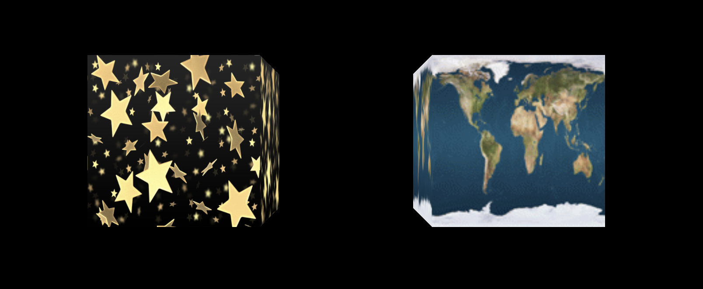
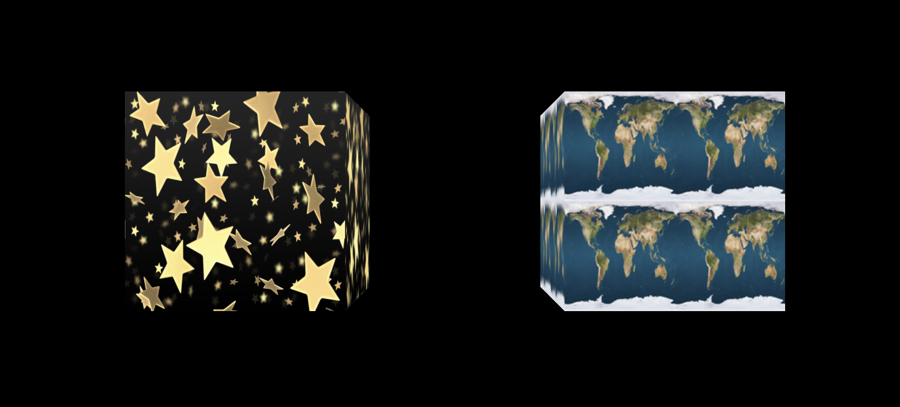
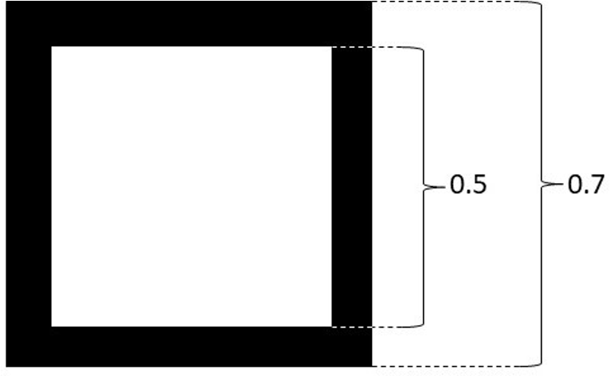
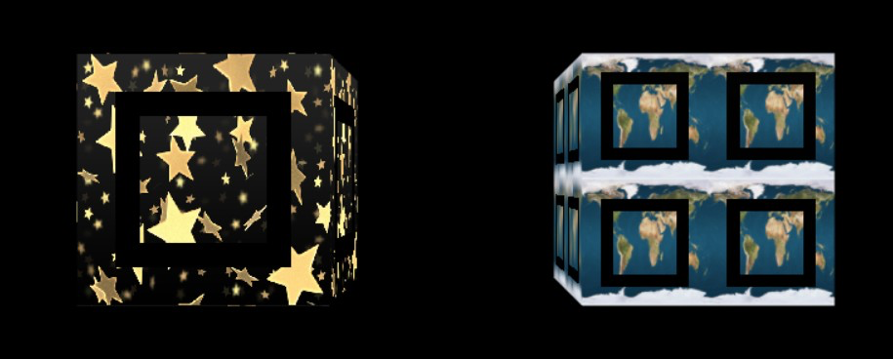

# Assignment 4: Texture Mapping

In this assignment, you will dive deeper into custom shaders with Three.js and learn to apply dynamic textures to 3D objects. You will load images as textures, modify fragment shaders to create custom effects, and animate objects/textures with transformation matrices and keyboard interactions.


## Goals

1. **Learn Texture Mapping**
   Load images as textures for 3D models, following Three.js guidelines.

2. **Apply Texture Filtering Techniques**  
   Experiment with nearest-neighbor filtering and mipmapping to understand their effects on rendering quality.

3. **Create Dynamic Textures with Custom Shaders**  
   Implement effects like scrolling and rotating textures.

4. **Create Interactivity and Animation:**  
   Use keyboard controls and continuous transformations to animate models.

---

## Getting Started

1. **Project Setup**  
  - Open the provided project. The main JavaScript file is `main.js`.
  - The scene contains two cubes: one on the left and one on the right.
  - Basic scene, camera, and renderer setup has already been provided.

2. **Implementation Notes** 
  - Code modifications are indicated by `TODO` comments with index. You are encouraged to follow the order of tasks to ensure a smooth implementation process.
  - You will mainly work with two custom shaders: `Texture_Scroll_X` and `Texture_Rotate`.
  - Feel free to create additional helper functions as needed.

---

## Assignment Tasks and Point Distribution

### 1. Load Images as Texture Maps

##### a. Load Two Different Square Images (2 points)
Implement functionality to load two different square images of your choice into texture maps. You must include all files needed to run your code in the "assets" folder of your repository (e.g., images).

**Remember**, not just any image that you download will work. Images used for texture maps in WebGL 1.0 must be square and have power of two dimensions (therefore only square images of a few limited sizes like 128x128 and 256x256 are valid). WebGL 2.0 doesn't have this limitation but it also isn't widely supported on phones yet so we don't use it.

**Implementation Guidance**: 
- Use the `THREE.TextureLoader()` class to load an image as a texture:
  
  ```javascript
  const texture = new THREE.TextureLoader().load('path/to/texture.png');
  ```

- Use the images under the `assets` folder:
  - `assets/stars.png` : 512x512
  - `assets/earth.gif` : 128x128

<!-- ##### b. Passing the Textures to cubes shader -->
Notice how after we created the `TextureLoader` objects, we included them to the respective `uniforms` variables, which is the information that will be passed to the shaders of each cube. This will allow the shader to access the values of the texture image and "paint" the faces using these textures. 
You should not be able to actually see the texture on the cube until after you have completed the next task.

##### b. Imlementing the basic textured shaders. (3 points)
Each 3D vertex in our mesh has a pre-defined UV coordinate. For the particular case of the cube shape, each vertex of each face of the cube has one of the following uv coordinates: (0, 0), (0, 1), (1, 0) or (1, 1). In our case, these per-vertex uv coordinates are defined in the THREE.BoxGeometry class so you will not need to define them manually. During rendering, these vertex-level UV coordinates are interpolated across the face of the cube, so in the fragment shader (for each fragment/pixel) we will have a pair of UV values, both uv in the [0, 1] range. Now we can obtain the right color by sampling the texture image at the corresponding uv location. For this simple shader, after we obtain the color from the texture, we will simply set the gl_FragColor to the color of the texture sampled at the UV coordinate.

Modify the fragment shader to display the texture on the cubes. The fragment shader should sample the texture color based on the UV coordinates and assign its value to the gl_FragColor variable.

**Implementation Guidance**:
- You can use the `vUv` attribute to access the texture coordinates in the fragment shader. To sample the texture, use the `texture2D()` function. For example:
  ```glsl
  vec4 texColor = texture2D(texture, vUv);
  ```

##### c. Apply Texture Filtering Techniques (1 points)
As we mentioned, the interpolated uv coordinate is a floating-point value that ranges from 0 to 1. If, for example, our texture image had 100x100 pixels, it would be trivial to sample at uv values like 0.01, 0.02, 0.03, etc by taking the color of the 1st, 2nd, 3rd or 4th pixel, respectively. But because in general in our fragment shader we will get arbitrary u-v floating point value pairs like (0.023, 0.648), we need a way to obtain a color from the texture even when it does not match the resolution of the texture image. Usually, given a uv pair, we will be combining the colors of the 4 pixels around that point. As you might have guessed, one option is to perform a bilinear interpolation between the 4 pixels of the textures to obtain the correct color. Another way of doing so would be to just take the color of the pixel that is closer to your uv coordinate. We will see how we can choose different methods in Three.js.

**Implementation Guidance**:
- For cube #1 that lies at the left side, the filtering should be set to use nearest neighbor (set texture's `magFilter` and `minFilter` attribute to `THREE.NearestFilter`). For cube #2 that lies at the right side, the filtering should be set to use tri-linear filtering with mipmapping enabled (set texture's `minFilter` attribute to `THREE.LinearMipmapLinearFilter`).

Once you've correctly applied the textures to the cubes, you should see the images displayed on the cubes' faces. As you move the camera nearer or farther away, along the z-axis, from the cubes we should see the effect of the texture filtering as the textures get smaller or larger. For the cube that uses poor sampling, the image should show grainy, flashing static noise at the pixel level.



### 2. Create Custom Shaders for Dynamic Texture
##### a. Shrink Texture of Cube #2 (3 points)
For Cube #2, modify the fragment shader to zoom out the texture by 50% so that the texture will shrink, making the image appear four times, once in each corner.

**Implementation Guidance**:
- To shrink the texture, you need to modify the texture coordinates before sampling the texture. You can achieve this by multiplying the `vUv` attribute by `2.0` in the fragment shader so that UV coordinates range from (0, 2) instead of (0, 1).
- set the texture's 'wrapS' and 'wrapT' attributes to `THREE.RepeatWrapping` to enable the texture to repeat when the UV coordinates exceed the range of (0, 1).


##### b. Scroll Texture of Cube #2 (5 points)
Use continuous scrolling the texture map on cube #2. Translate the texture varying the s texture coordinate by 4 texture units per second, causing it to slide along the box faces.

To code this part, modify the fragment shader of `Texture_Scroll_X` to scroll the texture horizontally. The texture should move from left to right and then wrap around to the left side again.
**Implementation Guidance**:
- In the fragment shader, the varying `vUv` stores the vec2 of pre-interpolated texture coordinates.
- The variable `animation_time` is already passed all the way through into the fragment shader for you. But you will need to update its value in the `animate()` function. You can compute the animation time similarly to previous assignments and ten use something like `cube1_uniforms.animation_time.value = animation_time`.
- In the fragment shader, modify the uv coordinates as a function of the `animation_time` value. Because we are just translating the points along the x coordinates, you can do something like `vUv.x = vUv.x + animation_time * scroll_speed` .Note this might not be the exact correct code.
- Consider using the `mod()` function to wrap the translation offset to prevent the translation offset growing indefinitely, which could cause the interpolated values to lose needed decimal precision.


##### c. Rotate Texture of Cube #1 (5 points)
Rotate the texture map itself on all faces of cube #1 around the center of each face at a rate of 8 rpm (4PI/15 rad/sec).

To code this part, modify the fragment shader of `Texture_Rotate` to rotate the texture. The texture should rotate around the center counterclockwise.
**Implementation Guidance**:
- You should implement a 2D rotation of points and rotate the uv coordinates according to the value of `animation_time`.
- One way to implement rotation of uv points is `new_vUv.x = vUv.x * cos(angle) - vUv.y * sin(angle)`, where `angle` is the rotation angle.
- Derive the corresponding formula for `new_vUv.y`. Note that this would be mathematically equivalent to using a 2D rotation matrix. 
- Note that this rotation should be around the center of the face, so you may need to translate the uv coordinates to the center of the face before and after rotating them.
- As with the scrolling texture, you should use the `mod()` function to wrap the rotation angle to prevent the rotation angle growing indefinitely.

Once you've correctly implemented the texture scrolling and rotation, you should see the animation effects as follows:

##### d. Add a black square outline to cubes (4 points)
Now add the outline of a black square in the center of each texture that moves with the texture. This should be done by just modifying the fragment shader.

The dimensions of the black square in the texture coordinate space are shown below:


**Note:** Recall that one of the cubes has 4 instances of the texture on one face. This cube requires 4 black square outlines in the center of each texture instance.

Below is what the square outlines should look like if the textures aren't moving:


And below is what the square outlines should look like if the textures are moving:


##### e. Rotate Cube with Keyboard Control (2 points)
Use key ‘c’ to start and stop the rotating both cubes. Cube #1 should rotate around its own X-axis at a rate of 15 rpm. Cube #2 should rotate around its own Y-axis at a rate of 40 rpm. **The cubes should not jump to a different angle when they start and stop.**


## Submission Instructions

Compress (zip) the whole assignment folder into a ZIP format compressed file. Submit it to the Assignment in Bruin Learn where you download this. 

Please make sure you included **everything except the node_modules folder** in the assignment, rather than only the file(s) you made changes. The structure of the compressed file should be the same with the provided assignment material.

---

## Resources

- **Three.js Documentation**: [https://threejs.org/docs/](https://threejs.org/docs/)
- **GLSL Reference**: [https://www.khronos.org/opengl/wiki/Core_Language_(GLSL)](https://www.khronos.org/opengl/wiki/Core_Language_(GLSL))
- **Shader Programming Tutorials**: [https://thebookofshaders.com/](https://thebookofshaders.com/)

---

If you have any questions or need clarification on the assignment, please reach out to your instructor or teaching assistant.

Good luck and have fun exploring the world of shaders and 3D animation in Three.js!